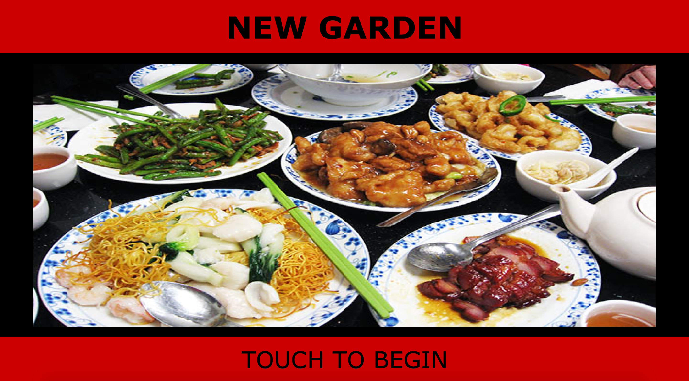
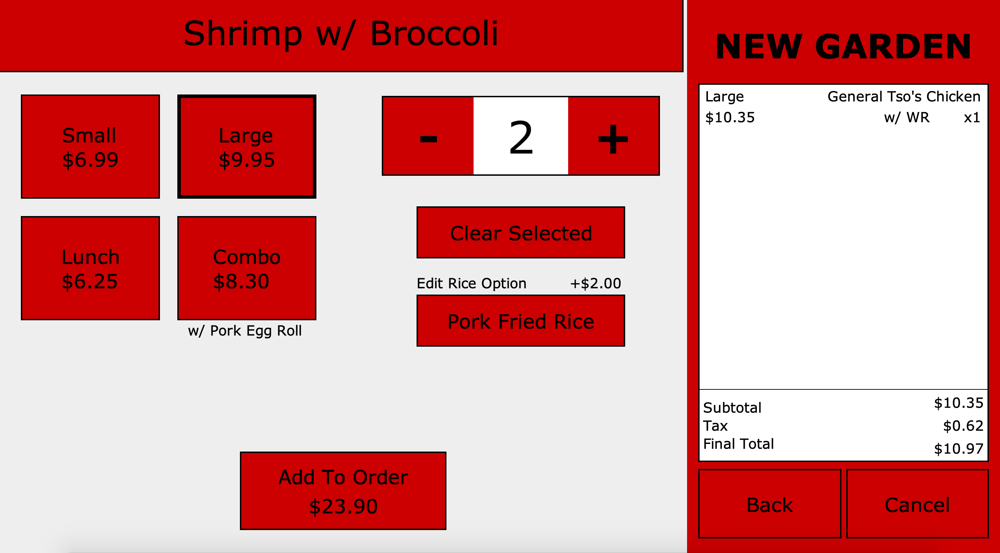
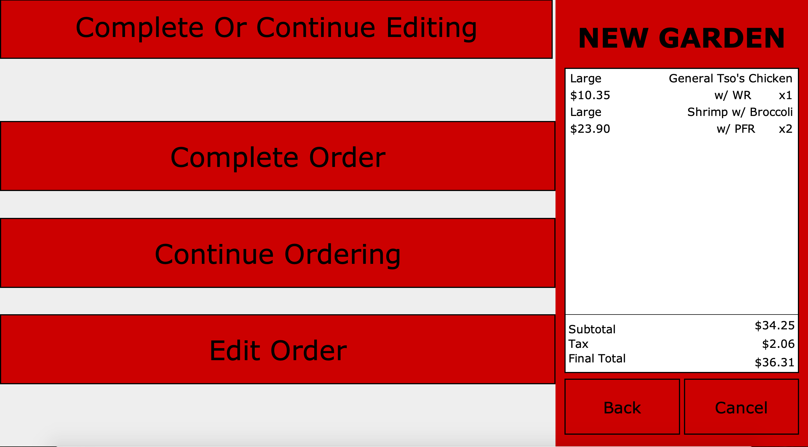
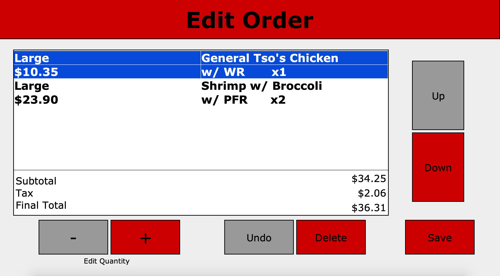
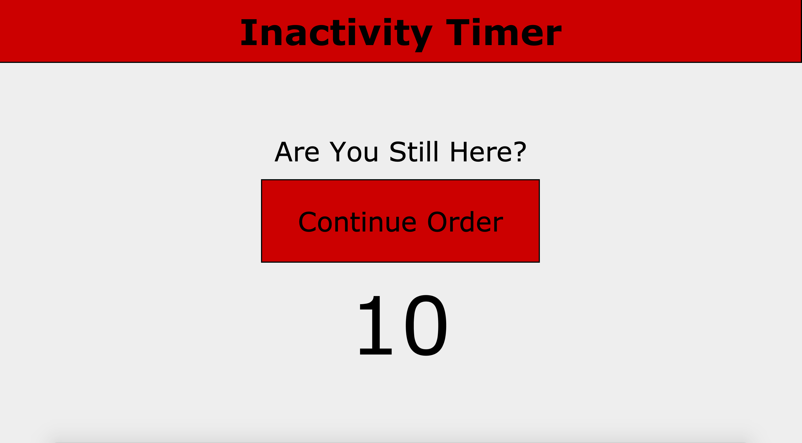
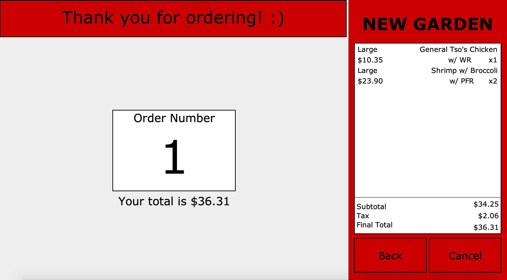
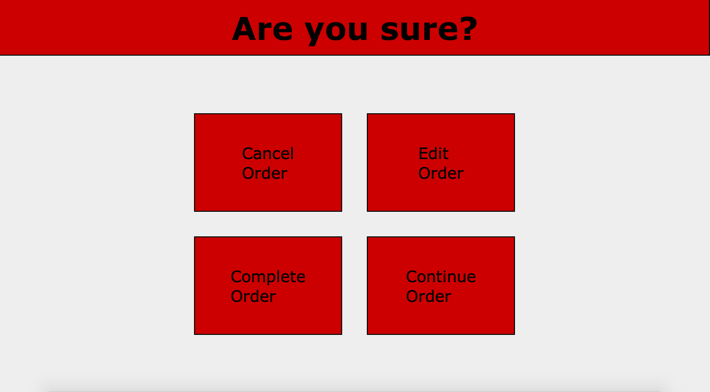

## Project Name & Pitch

Restaurant Point of Sale System

A Java Swing GUI allows users to place and customize food orders remotely from the menu of New Garden.

Built with Java (Netbeans) and SQL (PostgreSQL). Utilized layout managers MigLayout and CardLayout.

### Demo Video

## Installation and Setup Instructions

Clone down this repository. You will need `VS Code` and `PostgreSQL` installed globally on your machine.  

Start your PostgreSQL server. Copy the tables from the Database directory. In DBConnection.java, change the information to your own.

Open the repository with VS Code. Run the code.

## Reflection

The project was a passion project created in the summer of 2020. The project's goals included: using previously learned technologies, challenging myself to learn new libraries and tools without instruction, and solving a real-world issue (the inefficiency of taking customer orders with pen and paper).

Originally I wanted to build an application with Netbean's built-in GUI builder to create this project, allowing me to drag and drop panels into the interface. However, the limitations of the builder left me dissatisfied. Though I was past halfway through designing it, I decided to research different alternatives. I was able to discover MigLayout and Cardlayout, the foundation of the project.

One of the main challenges I ran into was the menu size. I initially had a JLabel and JPanel for every item on the menu (over 100 items). I didn't believe an array was the correct solution to store everything, leading me to spend a few days on a research spike into databases. I learned the basics of SQL and chose PostgreSQL because I felt it was most relevant to my goals. I stored the entire menu in a database that recorded the frequency of items to assist with inventory.

In the following iterations, there are a few things I wish to improve on. I want to include an "Employee" clearance allowing employees to change the menu dynamically. An example would be removing the option of a specific item if the inventory is empty. Another change is having a window that displays the restaurant's ingredient inventory. Both require visiting the database in the back end, making it clunky for the user. Lastly, I would've approached building this project differently. I was manually testing every time I inserted more complexity. Now I would include a form of automated testing.

## Project Screen Shots

